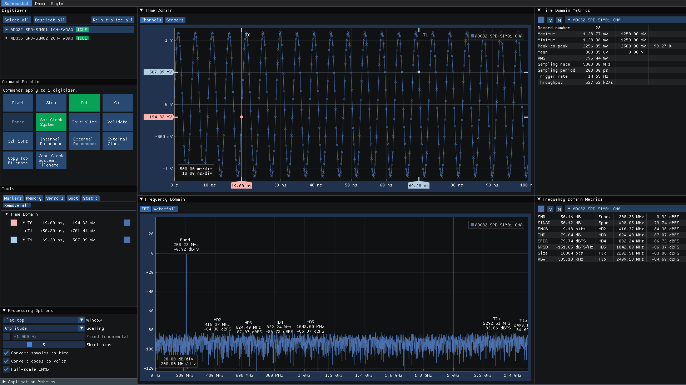

[](https://opensource.org/licenses/MIT)


# sigscape

This application is a minimal but feature rich GUI for ADQ3 series digitizers
from [Teledyne SP Devices](https://spdevices.com).

**This project is not affiliated with Teledyne SP Devices.** It's a passion
project I've developed to demonstrate the flexibility afforded to a user
application by the digitizer's API.



## Index

- [Core concepts](#core-concepts)
- [Building](#building)
- [License](#license)
- [Third-party dependencies](#third-party-dependencies)

## Core Concepts

### Configuration

Parameters are set via JSON files which you read and edit using your favorite
text editor. These files are generated and parsed by the digitizer's API (not
this application), leveraging the first-class support provided for this format.

The main benefit of this is an application that will hopefully hold up well over
time. When new features are added to the ADQ3 series digitizers, or existing
features change, this application will keep on working with minimal to no
intervention needed.

**There will be never be GUI elements to control the parameters of the digitizer
itself.** This obviously trades off some ease-of-use to create a GUI that's
cheap to maintain. This is by design.

### Multi-threaded Processing

The fact that the API calls used during the data acquisition phase are
thread-safe is leveraged to create a performant application with individual
data processing threads for each channel.

Running this application on CPUs with a low number of cores is not recommended.

## Building

### Linux

```
cmake -B build -G Ninja -DCMAKE_BUILD_TYPE=Release -S .
cmake --build build
```

On Ubuntu 22.04 the following libraries are needed:
```
apt install libgl1-mesa-dev libxrandr-dev libxinerama-dev libxcursor-dev libxi-dev libudev-dev
```

### Windows

```
cmake -B build -A x64 -S .
cmake --build build --config Release
```

## License

This application is free software released under the [MIT
license](https://opensource.org/licenses/MIT).

## Third-party dependencies

See [`THIRD_PARTY_LICENSES.md`](THIRD_PARTY_LICENSES.md)
